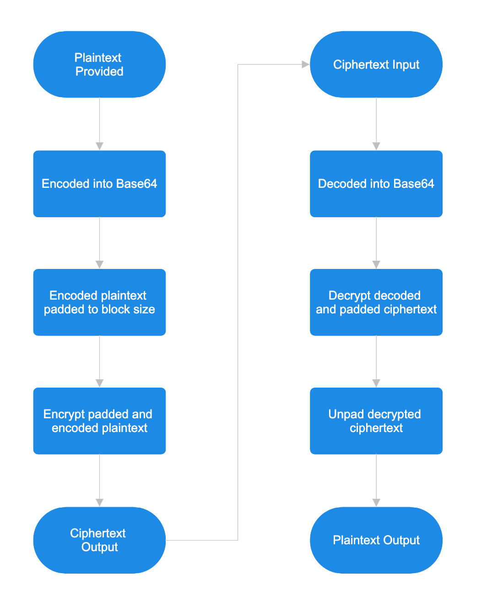

# Encryption and Decryption

The SSG APIs use symmetric key encryption to encrypt and decrypt your data when you transact with the API.

The API uses [Advanced Encryption Standard with 256-bit keys](https://en.wikipedia.org/wiki/Advanced_Encryption_Standard) 
(AES-256), with [Cipher Block Chaining (CBC)](https://en.wikipedia.org/wiki/Block_cipher_mode_of_operation#Cipher_block_chaining_(CBC))
and [PKCS7](https://en.wikipedia.org/wiki/PKCS_7) for encrypting and decrypting your messages.

> [!NOTE]
> **Plaintext** refers to the message prior to encryption, while **ciphertext** refers to the message
> prior to decryption.

## Encryption

The following steps are taken to encrypt your data:

1. The plaintext message (provided as a string or a sequence of bytes) is first encoded into Base64 format
2. The encoded message is then padded to the block size of the encryption algorithm
3. The padded message is then encrypted and the ciphertext is returned

## Decryption

The following steps are taken to decrypt your data:

1. The ciphertext (provided as a string or a sequence of bytes) is first decoded into Base64 format
2. The same encryption algorithm is used to decrypt the ciphertext to recover the padded plaintext
3. The padding is removed and the unpadded plaintext is returned

## Process

The following image displays the overall encryption and decryption process.

The left process describes the encryption process, while the right process describes the decryption process.
