# Developer Guide

Welcome to the SSG-WSG Sample Application Developer Guide!

## Table of Contents

1. [Acknowledgements](#Acknowledgements)
2. [Introduction](#Introduction)
    1. [Notation](#Notation)
3. [Getting Started](#Getting-Started)
    1. [Minimum Requirements](#Minimum-Requirements)
    2. [Next Steps](#Next-Steps)
4. [Design](#Design)
    1. [Architecture](#Architecture)
        1. [Entrypoint](#Entrypoint)
        2. [User Flow](#User-Flow)
        3. [AWS Architecture](#AWS-Architecture)
        4. [Pages](#Pages)
            1. [`Encryption-Decryption`](#Encryption-Decryption)
            2. [`Courses`](#Courses)
            3. [`Enrolment`](#Enrolment)
            4. [`Attendance`](#Attendance)
            5. [`Assessments`](#Assessments)
            6. [`SkillsFuture Credit Pay`](#SkillsFuture-Credit-Pay)
        5. [Core](#Core)
        6. [Utils](#Utils)
        7. [Tests](#Tests)
    2. [AWS Architecture](#AWS-Architecture)
5. [Implementation](#Implementation)
6. [DevOps](#DevOps)
7. [Logging, Housekeeping and CI/CD](#Logging-Housekeeping-and-CICD)
    1. [Logging](#Logging)
    2. [Housekeeping](#Housekeeping)
        1. [`start_scheduler()`](#start_scheduler)
        2. [`_clean_temp()`](#_clean_temp)
        3. [Extending tasks to perform](#Extending-tasks-to-perform)
    3. [CI/CD](#CICD)
8. [Glossary](#Glossary)

## Acknowledgements

Code from the application is reused from multiple sources:

* ChatGPT
    * https://chatgpt.com/share/27060ade-b2e2-4b83-9a5b-238d23e0656a
* nric.biz
    * https://nric.biz/
* Protecto.ai
    * https://www.protecto.ai/blog/personal-dataset-sample-singapore-national-registration-identity-card-number-download-pii-data-examples
* Python Docs
    * https://docs.python.org/3/library/logging.html#module-logging
    * https://docs.python.org/3/howto/logging-cookbook.html
* [samliew.com](samliew.com)
    * https://samliew.com/nric-generator
* StackOverflow
    * https://stackoverflow.com/questions/25389095/python-get-path-of-root-project-structure
    * https://stackoverflow.com/questions/16981921/relative-imports-in-python-3
    * https://stackoverflow.com/questions/1732438/how-do-i-run-all-python-unit-tests-in-a-directory
    * https://stackoverflow.com/questions/53249304/how-to-list-all-existing-loggers-using-python-logging-module
    * https://stackoverflow.com/questions/15435652/python-does-not-release-filehandles-to-logfile
    * https://stackoverflow.com/questions/45984018/python-unit-test-to-check-if-objects-are-same-at-different-location
    * https://stackoverflow.com/questions/25389095/python-get-path-of-root-project-structure
    * https://stackoverflow.com/questions/4330812/how-do-i-clear-a-stringio-object
    * https://stackoverflow.com/questions/6793575/estimating-the-size-of-binary-data-encoded-as-a-b64-string-in-python
    * https://stackoverflow.com/questions/19922790/how-to-check-for-python-the-key-associated-with-the-certificate-or-not
* SingStat
    * https://www.singstat.gov.sg/-/media/files/standards_and_classifications/educational_classification/classification-of-lea-eqa-and-fos-ssec-2020.ashx
* Squash.io
    * https://www.squash.io/how-to-delete-a-file-or-folder-in-python/
* Streamlit
    * https://discuss.streamlit.io/t/st-code-on-multiple-lines/50511/8
* SAP
    * https://userapps.support.sap.com/sap/support/knowledge/en/2572734
* uen.gov.sg
    * https://www.uen.gov.sg/ueninternet/faces/pages/admin/aboutUEN.jspx.

This guide's structure is also heavily inspired
by https://github.com/AY2324S1-CS2103T-T17-1/tp/blob/master/docs/DeveloperGuide.md.

## Introduction

In this guide, you will learn more about the underlying design and architecture of the application, the features of the
application, and how you can maintain or develop on them.

### Notation

Some special notation will be used througout the Developer Guide. Do make sure to familiarise yourself with the notation
below to avoid misunderstandings and confusions regarding the content of the guide!

Text in **green** callout boxes are some tips and tricks that you should be aware of:

> [!TIP]
> This is a tip!

Text in **blue** callout boxes are informational messages that you should take note of:

> [!NOTE]
> This is a note!

Text in **yellow** callout boxes are warnings that you should take note of to ensure that you do not encounter an error:

> [!WARNING]
> This is a warning!

Text in **red** callout boxes are potential errors which you may encounter:

> [!CAUTION]
> This is a potential error!

## Getting Started

Before you start, make sure that you use a device that supports the minimum requirements needed to run the Sample
Application on your device.

### Minimum Requirements

The Sample Application is developed using Python `3.12` and uses Docker for containerisation.

If you are not sure how to Python `3.12` or Docker, head over to the
[Installation Guide](Installation%20Guide.md) for more information about the installation process.

### Next Steps

Now that you have installed the requirements for the Sample Application, you can now begin developing new features or
fixing bugs within the application!

Refer to the [Design](#Design) section for more information about the overall architecture of the application.

Refer to the [Implementation](#Implementation) section for more information about the features of the application,
and how they are implemented in code.

Refer to [Logging, Housekeeping and CI/CD](#Logging-Housekeeping-and-CICD) for more information about the logging,
housekeeping and CI/CD processes of the application, so that you are better able to maintain the application.

## Design

The Sample Application is designed to be a simple monolithic Python application that allows for rapid prototyping
and UI/UX development, by using a UI/UX framework called Streamlit.

Unlike traditional UI/UX frameworks and languages like React or Flutter, Streamlit blurs the line between the backend
and frontend, by allowing developers to write Python code that generates UI/UX elements and handle the logic behind the
UI/UX elements all in the same file, and often without much abstraction of logic between them.

### Architecture

The below diagram features the overall architecture of the application:

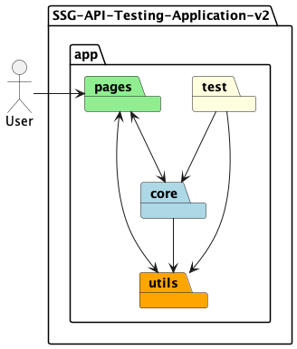

The application has 4 main components:

* `pages`: This component contains the Streamlit pages that are rendered when the application is run. Each page is
  responsible for rendering a set of UI/UX elements and handling the process behind calling a specific set of
  APIs. Pages also contain some logic to handle the rendering of UI/UX elements and the processing
  of data for the backend. This can be considered the "frontend" part of the application.
* `core`: This component contains the core logic of the application. This can be considered the "backend" part of the
  application.
* `utils`: This component contains utility functions that are used across the application.
* `tests`: This component contains the unit tests for the application.

We will explore in greater detail each of the components in the following sections.

#### Entrypoint

The entrypoint to the application is the `Home.py` file located in the `app` directory.

This file is a special page that is initially rendered when the application is first run. It provides users with the
opportunity to enter in their credentials to authenticate themselves with the APIs and to access the other non-Home
pages, that will be described below under [Pages](#Pages).

To start the application, run the following command within the [`app`](../app) directory:

```shell
streamlit run Home.py
```

The process taken to start the Streamlit server is detailed below in the sequence diagram:

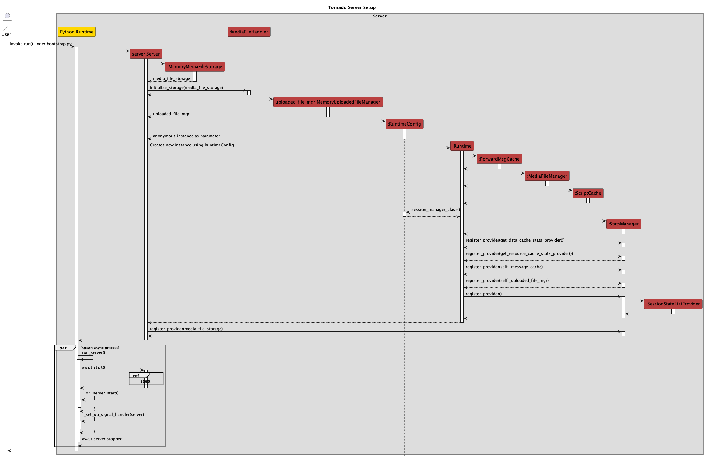

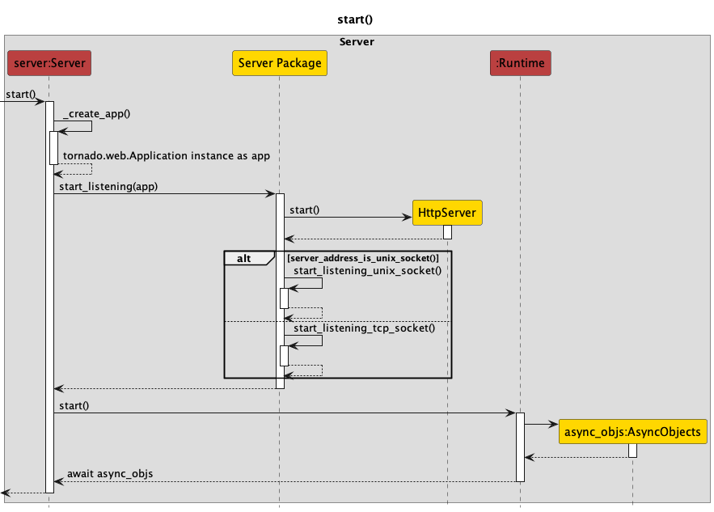

1. `run` from `bootstrap.py` is invoked
2. This creates an instance of `Server`, which forms the abstraction of the Streamlit Server where the application is
   served
3. In the constructor for `Server`,
    1. `MemoryMediaFileStorage`, `MediaFileHandler`, `MemoryUploadedFileManager` are initialised
    2. `Runtime` is initialised, and in the process, `RuntimeConfig` is also initialised and passed to `Runtime`
4. In the constructor for `Runtime`,
    1. `ForwardMsgCache`,  `MediaFileManager` and `ScriptCache` are initialised
    2. When creating an instance of `StatsManager`, `Runtime` invokes `StatsManager::register_provider()` to register
       the data, resources and message caches and the uploaded file manager. It also registers
       a `SessionStateStatProvider`
       object initialised by `StatsManager`.
5. `Server` then registers the `MemoryMediaFileStorage` object as a provider by
   invoking `StatsManager::register_provider()`
6. In a spawned asynchronous thread,
    1. `run_server()` is invoked, which invokes and awaits for the `Server::start()` method to return
        1. `Server::_create_app()` is invoked, which returns an instance of `tornado.web.Application`
        2. `start_listening(app)` from the server package is then invoked
        3. `HttpServer::start()` is invoked
        4. If the server address is a UNIX socket, `start_listening_unix_socket()` is invoked, else
           invoke `start_listening_tcp_socket()`
    2. `Runtime::start()` is finally invoked and awaited, which creates `AsyncObjects` and returns them to `Server`
7. The server is up and running

For most intents and purposes, it is highly unlike you will need to modify any of these processes, as they are provided
by the Streamlit library.

This section is to aid you in understanding how the Streamlit server is started and how the application is served.

#### User Flow

Once the server is started, you are able to access it via:

```text
http://localhost:[YOUR PORT HERE]
```

> [!NOTE]
> Replace `[YOUR_PORT_HERE]` entirely with the port number that is used in
> the [Streamlit configuration file](../app/.streamlit/config.toml).
>
> By default, the port number is set to `80`.

The following diagram showcases how a user might interact with the application:

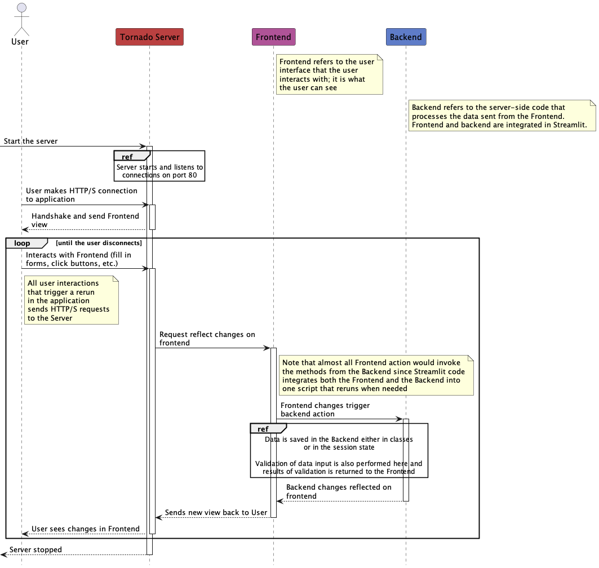

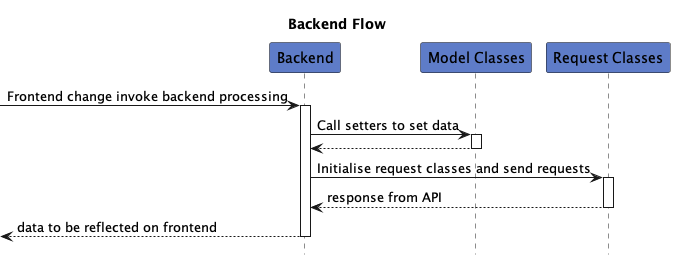

1. The server is started
2. User makes a HTTP/HTTPS connection to the server
3. While the server is active,
    1. When the user interacts with the frontend UI elements, HTTP requests are sent to the server
    2. The request trigger a change on the frontend
    3. This frontend change (usually) triggers a backend action
        1. For data entry changes, setters for backend model classes are called
        2. For event triggers (such as clicking buttons), depending on the event in question, either UI changes are made
           or backend logic is executed that calls external APIs
    4. Backend changes is then pushed to the frontend
    5. The user's view is then updated with the changes made

This flow is also something that you will highly unlikely need to modify, as it is provided by the Streamlit library.

However, the frontend to backend and then backend to frontend loop is something that you can modify if you wish.

#### Pages

The [`pages`](../app/pages) component contains the Streamlit pages that are rendered when the application is run.

The 6 non-Home pages in the application are contained in this component:

* [`Encryption-Decryption`](#Encryption-Decryption)
* [`Courses`](#Courses)
* [`Enrolment`](#Enrolment)
* [`Attendance`](#Attendance)
* [`Assessments`](#Assessments)
* [`SkillsFuture Credit Pay`](#SkillsFuture-Credit-Pay)

Each page of the application either showcases a certain functionality required for the application or utilises a
particular set of SSG APIs.

More information about the APIs are provided on
the [SSG Developer Portal](https://developer.ssg-wsg.gov.sg/webapp/api-discovery).

> [!TIP]
> Each page is designed to be modular and independent of each other. This means that you can modify each page
> without affecting the other pages.
>
> To develop new pages, follow the process as described in this [README.md](../app/pages/README.md) file.

##### `Encryption-Decryption`

This page allows users to encrypt and decrypt text using their encryption key.

The class diagram of classes involved in the creation of this page is as follows:

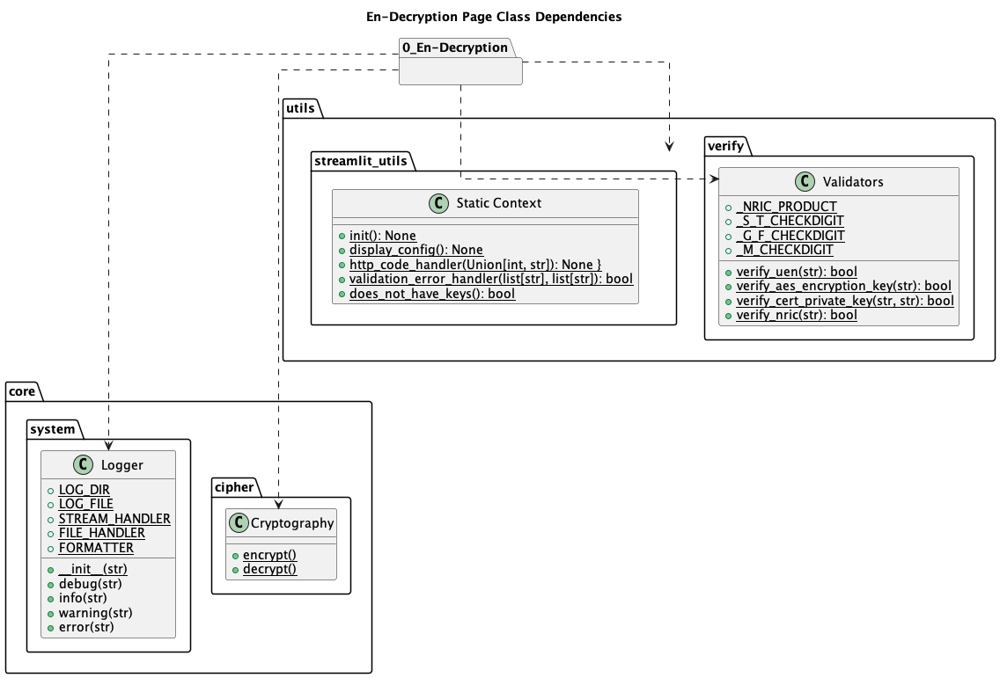

##### `Courses`

This page allows users to call the Courses API. More specifically, users can call the following APIs:

* Add Course Run
* Edit Course Run
* Course Run by Run Id
* Course Sessions

Users can navigate to the screen supporting the above APIs by clicking on the respective tabs.


The class diagram of classes involved in the creation of this page is as follows:


##### `Enrolment`

This page allows users to call the Enrolment API. More specifically, users can call the following APIs:

* Create Enrolment
* Update Enrolment
* Cancel Enrolment
* Search Enrolment
* View Enrolment
* Update Enrolment Fee Collection

Users can navigate to the screen supporting the above APIs by clicking on the respective tabs.


The class diagram of classes involved in the creation of this page is as follows:

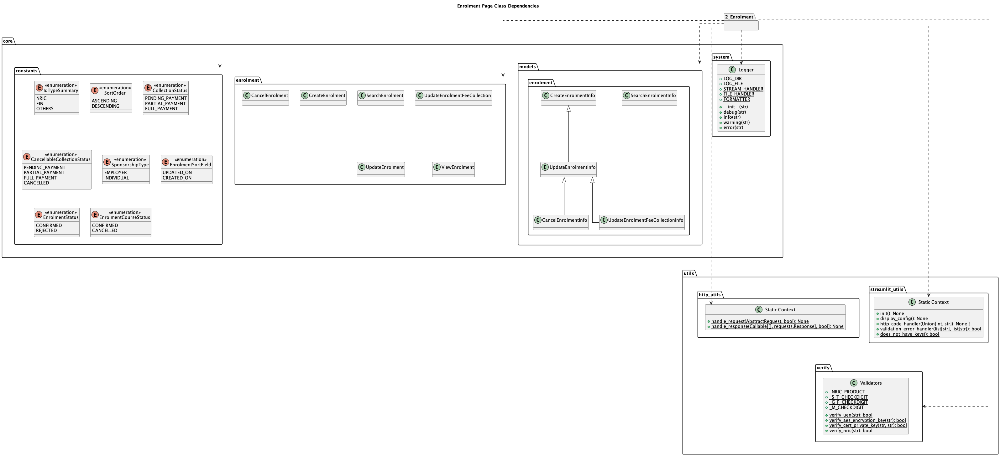

##### `Attendance`

This page allows users to call the Attendance API. More specifically, users can call the following APIs:

* Course Session Attendance
* Upload Course Session Attendance

Users can navigate to the screen supporting the above APIs by clicking on the respective tabs.


The class diagram of classes involved in the creation of this page is as follows:


##### `Assessments`

This page allows users to call the Assessments API. More specifically, users can call the following APIs:

* Create Assessment
* Update/Void Assessment
* Search Assessment
* View Assessment

Users can navigate to the screen supporting the above APIs by clicking on the respective tabs.


The class diagram of classes involved in the creation of this page is as follows:

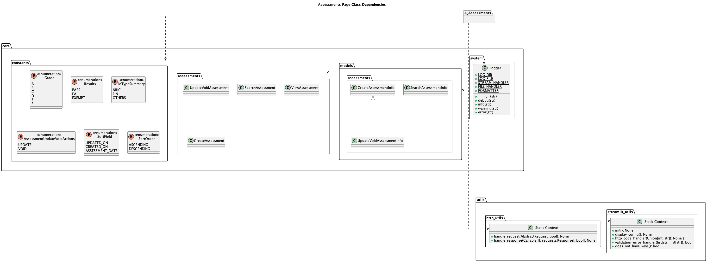

##### `SkillsFuture Credit Pay`

This page allows users to call the SkillsFuture Credit Pay API. More specifically, users can call the following APIs:

* Payment Request Encryption
* Payment Response Decryption
* Upload Supporting Documents
* View Claim Details
* Cancel Claim

Users can navigate to the screen supporting the above APIs by clicking on the respective tabs.


The class diagram of classes involved in the creation of this page is as follows:

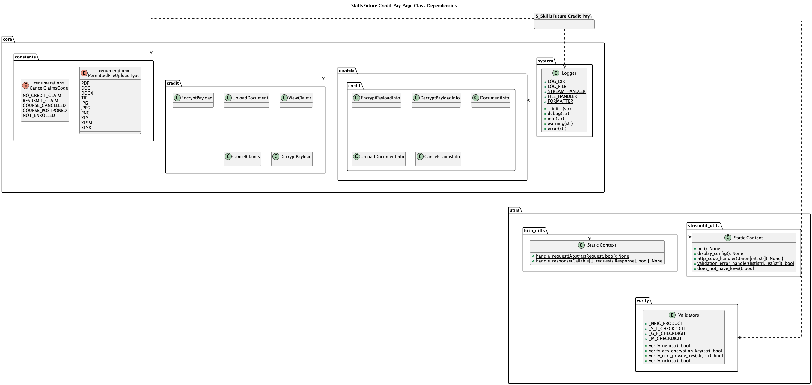

#### Core

The [`core`](../app/core) component contains the core logic of the application.

The structure of the component is as such:

* [`abc`](../app/core/abc): Contains abstract classes that are used to define the structure of the classes in the
  component
* [`assessments`](../app/core/assessments): Contains classes that are used to interact with the Assessments API
* [`attendance`](../app/core/attendance): Contains classes that are used to interact with the Attendance API
* [`cipher`](../app/core/cipher): Contains classes that are used to encrypt and decrypt payloads for the API
* [`courses`](../app/core/courses): Contains classes that are used to interact with the Courses API
* [`credit`](../app/core/credit): Contains classes that are used to interact with the SkillsFuture Credit Pay API
* [`enrolment`](../app/core/enrolment): Contains classes that are used to interact with the Enrolment API
* [`models`](../app/core/models): Contains classes that are used to create objects to hold data used in the different
  APIs
* [`system`](../app/core/system): Contains classes that are used to handle system-level operations and logging

The following class diagram showcases the classes involved in the core component, as well as the connections between the
classes:

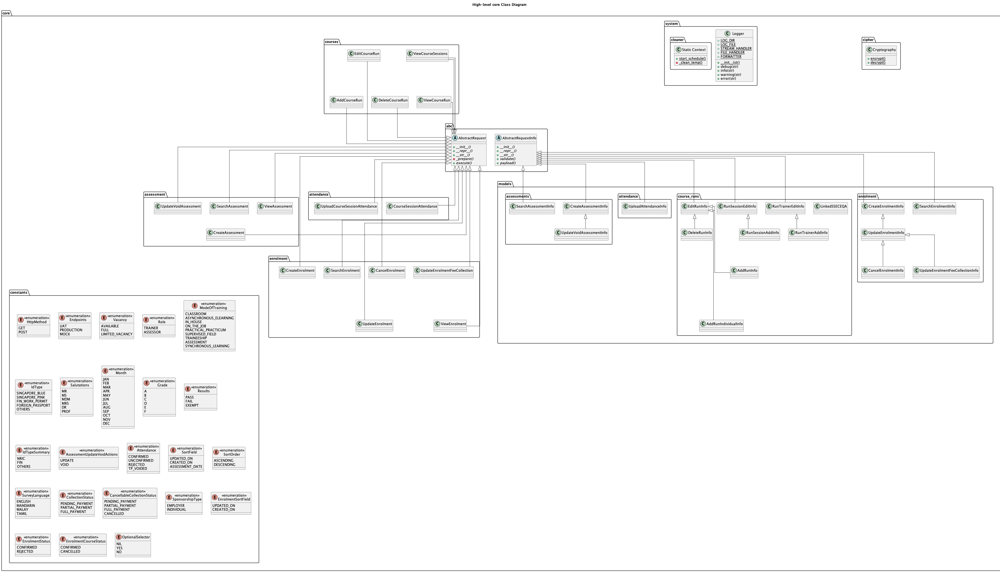

> [!WARNING]
> You should not modify the classes in this component unless you are sure of what you are doing. The classes in this
> component are used to interact with the SSG APIs and are critical to the functioning of the application!

#### Utils

The [`utils`](../app/utils) component contains utility functions that are used across the application.

The structure of the component is as such:

* [`http_utils`](../app/utils/http_utils.py): Contains classes that are used to make HTTP requests to the SSG APIs
* [`json_utils`](../app/utils/json_utils.py): Contains classes that are used to handle JSON payloads
* [`streamlit_utils`](../app/utils/streamlit_utils.py): Contains classes that are used to handle Streamlit-specific
  operations
* [`string_utils`](../app/utils/string_utils.py): Contains classes that are used to handle string operations
* [`verify`](../app/utils/verify.py): Contains classes that are used to verify data inputs by users

The following class diagram showcases the classes involved in the utils component, as well as the connections between
the classes:

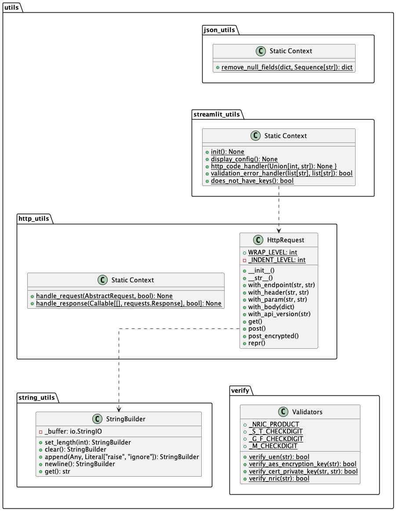

> [!WARNING]
> You should not modify the classes in this component unless you are sure of what you are doing. The classes in this
> component are used to provide utility functions that are used across the application!
>
> You may, however, add new utility functions to this component if you wish to extend the functionality of the
> application.

#### Tests

The [`tests`](../app/test) component contains the unit tests for the application.

The structure of the component is as such:

* [`checkstyle`](../app/test/checkstyle): Contains classes that are used to check the style of the code
* [`core`](../app/test/core): Contains classes that are used to test the core component
* [`resources`](../app/test/resources): Contains resources that are used in the unit tests
* [`utils`](../app/test/utils): Contains classes that are used to test the utils component

### AWS Architecture

This application is also hosted on AWS. More information about the AWS cloud architecture is provided in the
[Deployment Guide](Deployment%20Guide.md).

## Implementation

Since Streamlit uses a rather declarative approach to UI/UX development, the following section will focus on how the
encryption/decryption processes, 15 mandated APIs, SkillsFuture Credit Pay APIs are implemented in the application.

The UI and UI logic should be self-explanatory enough as you read the code and will hence not be covered in this
section.

### Encryption and Decryption

The En-Decryption page uses the following classes/methods from the `core` and `utils` component to encrypt and decrypt
text:

* `core.cipher.encrypt_decrypt.Cryptography`
    * Provides encryption and decryption capabilities
* `core.system.logger.Logger`
    * Provides logging capabilities
* `utils.streamlit_utils.init`, `utils.streamlit_utils.display_config`
    * Provides Streamlit-specific capabilities
* `utils.verify.Validators`
    * Provides validation capabilities for AES-256 keys

Together, they provide users with the ability to use their AES-256 keys to encrypt and decrypt text.

To find out more about the algorithms and processes used for encryption and decryption, head over to the
[Encryption and Decryption README](../app/core/cipher/README.md) for a more in-depth explanation.

### Courses

#### Course Run by Run Id

#### Add Course Runs

#### Edit or Delete Course Runs

#### View Course Sessions

### Enrolment

#### Create Enrolment

#### Update Enrolment

#### Cancel Enrolment

#### Search Enrolment

#### View Enrolment

#### Update Enrolment Fee Collection

### Attendance

#### Course Session Attendance

#### Upload Course Session Attendance

### Assessment

#### Create Assessment

#### Update or Void Assessment

#### Find Assessment

#### View Assessment

### SkillsFuture Credit Pay

#### SF Credit Claims Payment Request Encryption

#### SF Credit Claims Payment Request Decryption

#### Upload Supporting Documents

#### View Claim Details

#### Cancel Claim

## DevOps

The following section will explore more about the DevOps processes involved in maintaining/developing the Sample
Application. It will also detail some of the existing workflows that are implemented in the application.

### GitHub Setup

You may wish to set up a GitHub repository to host a copy of the code. This will allow you to collaborate with other
developers or contribute to the main codebase.

To set up a GitHub repository, follow the steps below:

1. Create a GitHub Account (if you don't already have one). Click [here](https://github.com/join) to create an account,
   and [here](https://docs.github.com/en/get-started/start-your-journey/creating-an-account-on-github) to find out more
   about how you can create a GitHub account.
2. Head over to the Repository where the [Sample Application codebase](https://github.com/ssg-wsg/Sample-Codes) is
   hosted on.
3. Fork the repository. Click on the `Fork` button in the top right corner of the repository page to fork it.

> [!INFO]
> *Forking* refers to the process of creating a copy of the repository in your GitHub account. This allows you to make
> changes to the codebase without affecting the upstream codebase, while also allowing you to contribute to the upstream
> repository.

4. Follow the process outlined in the [Installation Guide](Installation%20Guide.md) to download the forked codebase into
   your computer.
   Make sure to follow the second method to download your code, as you will need `git` to make changes to the forked
   codebase.
5. Make changes to the codebase as you see fit.
6. Push the changes to your forked repository. Follow the steps below to push your changes:
    1. Add the changes to the staging area by running the following command in the location where the forked codebase is
       downloaded to:
        ```shell
        git add .
        ```
    2. Commit the changes by running the following command:
        ```shell
        git commit -m "Your commit message here"
        ```
    3. Push the changes to your forked repository by running the following command:
        ```shell
        git push origin main
        ```
    4. Alternatively, you may use third-party applications such as [Sourcetree](https://www.sourcetreeapp.com/)
       or [GitHub Desktop](https://github.com/apps/desktop) to help you complete
       the above actions through a graphical user interface.
    5. Create a Pull Request (PR) to the upstream repository. Click on the `Pull Request` button in your forked
       repository to create a PR.
       Follow the instructions to create a PR.

For CI/CD to work, make sure to add the following secrets to your repository:

* `CODECOV_TOKEN`: The token used to upload code coverage reports to Codecov
* `AWS_ACCESS_KEY_ID`: The Access Key ID for your AWS account
* `AWS_SECRET_ACCESS_KEY`: The Secret Access Key for your AWS account

Head over to [this](https://docs.github.com/en/actions/security-guides/using-secrets-in-github-actions?tool=webui)
website to find out more about how you can add secrets to your repository.

> [!INFO]
> More information about what the tokens do and how you need to configure your AWS and Codecov account
> can be found in the [Deployment Guide](Deployment%20Guide.md#github)!

### CI/CD

CI/CD represents Continuous Integration and Continuous Deployment. This is a process where code is automatically tested
and deployed to a server when a new commit is pushed to the repository.

For the Sample Application, the automation of unit testing, checkstyle and deployment is done in part using GitHub
Actions.

Refer to the [GitHub Actions CI/CD workflow file](../../.github/workflows/integration.yml) for a better understanding of
the
process.

The different stages of the CI/CD pipeline is as such:

1. **Test**: Conduct unit tests and checkstyle on the codebase
    1. Start the pipeline on all major OSes (Windows, MacOS, Linux)
    2. Checkout (clone) the repository
    3. Install Python `3.12` on the GitHub runner
    4. Install the Python dependencies
    5. Execute the unit tests
    6. Upload the code coverage reports to Codecov
2. **Setup**: Sets up the S3 bucket used for Terraform backend
    1. Start the pipeline on Ubuntu
    2. Checkout (clone) the repository
    3. Set up Terraform
    4. Verify the Terraform script by formatting and then conducting a check again
    5. Initialise Terraform backend
    6. Validate the Terraform script to run
    7. View the plan for the Terraform deployment
    8. Apply the Terraform plan (this step is failable as the backend S3 bucket and DynamoDB tables may already exist)
3. **Deploy**: Use Terraform to deploy the application to AWS
    1. Start the pipeline on Ubuntu
    2. Checkout (clone) the repository
    3. Set up Terraform
    4. Verify the Terraform script by formatting and then conducting a check again
    5. Initialise Terraform backend
    6. Validate the Terraform script to run
    7. View the plan for the Terraform deployment
    8. Apply the Terraform plan

Here is a diagram representing the overall flow of processes implemented in the workflow file:

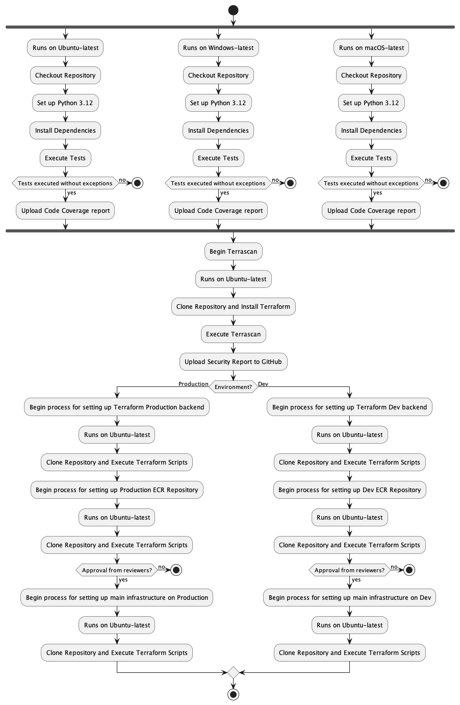

## Logging and Housekeeping

To assist you in logging and removing unused credential files for housekeeping, we have put in place some helpful
features to help you achieve just that!

These tools might come in useful when you are debugging the application, or when you are maintaining the application

### Logging

We have implemented a utility `Logger` class, located under in `logger.py` under
the [`app.core.system`](../app/core/system) package.

The `Logger` class uses a global `StreamHandler` and `FileHandler` to print out logs to `stdout` and save the logs to a
file under `app/.log/log.txt`.

> [!NOTE]
> `StreamHandler` is used to print out the log text to `stdout`.
>
> `FileHandler` is used to save the log text to a designated log file.

The `Logger` class has 4 main methods to allow you to log messages of different severity:

* `Logger::debug()`: logs a DEBUG level message - use this for debugging the application
* `Logger::info()`: logs an INFO level message - use this for informative messages that you wish to log
* `Logger::warning()`: logs a WARNING level message - use this for exceptional but non-critical events that you wish to
  note
* `Logger::error()`: logs an ERROR level message - use this for exceptional events that are critical

The `Logger` class also has another utility method: `Logger::close()`, which is used to shut down the `Logger` instance.
You may indicate `close_handler = False` to override the default behaviour of closing the global handlers in the loggers
as well.

### Housekeeping

To help you better maintain the state of the temporary file location used to store your uploaded credentials, we have
implemented a "garbage collector" method in `cleaner.py` under the `app.core.system` package.

The "garbage collection" package used is `apscheduler`, a non-blocking task scheduling library in Python. This library
allows you to create cron (interval) tasks that will be performed at a specified time interval without blocking the
execution of the base Sample Application.

We chose those to use this package over other packages due to its ease of use, compatability with Streamlit and the
lack of the need to write explicit multithreading/concurrent code to execute cron task.

#### `start_scheduler()`

`start_scheduler()` is the main method used to start the scheduler. The following details the steps taken when the
method is called:

1. Check if the task with job ID equals to `UNIQUE_JOB_ID` is already present in the task scheduling pool
2. If it is not in the pool, create a new task to add to the pool.
    1. Specify the time interval as 7 days
    2. Specify the job ID as `UNIQUE_JOB_ID`
    3. Specify to replace any existing jobs with the same job ID to prevent conflicts over which tasks is the latest
       task
    4. Start the scheduler
3. If the job ID is in the pool, return immediately and do nothing

> [!TIP]
> Do note that the interval is arbitrarily set, you may wish to use another interval for a stricter housekeeping and
> certificate and private key retention policy.

#### `_clean_temp()`

`_clean_temp()` is the task that the scheduler will execute at a fixed interval.

This (private) method does the following:

1. Iterate through all files in the temporary directory where the certificate and key files are uploaded and saved into
2. If the filename ends with `.pem`, remove it

#### Extending tasks to perform

If you wish to include more cron tasks to perform, feel free to define more methods within this file, and add them into
the scheduler within `start_scheduler()`, defining the interval in which to execute the task.

## Glossary

| Term | Definition |
|------|------------|
|      |            |
